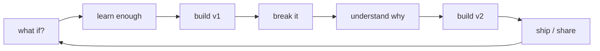

<div align="center">


# YATHARTH VIKRAM SINGH

### I don't have one niche. I have one pattern:

## **see something interesting → ask “what if?” → build it**

[](https://www.vymra.org/)
[](https://www.linkedin.com/in/rajputyatharth0007/)
[](https://github.com/Rajputyatharth0007)

</div>

---

```text
┌────────────────────── YATHARTH.exe ──────────────────────┐
│ role       curious builder                               │
│ base       VYMRA                                         │
│ mode       learn by making                               │
│ fuel       "what if?"                                    │
│ output     apps / experiments / systems / broken v1s     │
│ warning    may turn random ideas into actual projects    │
└───────────────────────────────────────────────────────────┘
```

## // THIS PROFILE IS NOT A RESUME

I don't want this page to be a list of technologies with percentage bars pretending I know exactly where I stand.

This is closer to a **build log**.

Some ideas become projects.  
Some projects become products.  
Some break in spectacular ways.  
All of them teach me something.

> **I keep asking “what if?” until it turns into “it works.”**

---

## // THINGS THAT ESCAPED MY HEAD

<table>
<tr>
<td width="50%" valign="top">

### 🚀 01 / VYMRA
Not one project.

A place for the bigger journey: building, experimenting, shipping, documenting, and seeing how far an idea can be pushed.

**theme:** technology × curiosity × creation

**[ENTER VYMRA →](https://www.vymra.org/)**

</td>
<td width="50%" valign="top">

### 🧭 02 / CLF
**what if buildings had their own GPS?**

ConneXity Location Finder explores indoor navigation using Wi-Fi signals, motion sensors, maps, localization, and route guidance.

Not my whole identity.  
Just one very ambitious question.

</td>
</tr>

<tr>
<td width="50%" valign="top">

### 😈 03 / DEVIL AI
**what if AI agents worked like a team?**

A Google Vibe Coding Hackathon experiment around multi-agent thinking, fast prototyping, and building with AI instead of only talking about it.

**[OPEN THE EXPERIMENT →](https://github.com/Rajputyatharth0007/first-hackathon-of-our-life-)**

</td>
<td width="50%" valign="top">

### 🎮 04 / SMALL BUILDS
Sometimes the best way to understand a concept is to make something move on screen.

Python GUI games, app experiments, Flutter interfaces, web builds, and whatever I decide to break next.

**[TIC-TAC-TOE →](https://github.com/Rajputyatharth0007/tik-tak-toe)**  
**[GUESS THE NUMBER →](https://github.com/Rajputyatharth0007/Guess-the-number-game-using-GUI)**

</td>
</tr>
</table>

---

## // CURRENTLY BREAKING

```text
[ AI / AGENTS ]       learning how systems think together
[ FLUTTER ]           turning ideas into mobile interfaces
[ WEB ]               building things people can actually use
[ SPATIAL TECH ]      maps, positioning, indoor navigation
[ PRODUCT THINKING ]  less "cool demo", more "would someone use this?"
[ VYMRA ]             figuring out what this can become
```

The exact tools will change.

The habit probably won't.

---

## // TOOLS I'VE LEFT FINGERPRINTS ON

<div align="center">


</div>

```text
not mastery meters.
not a checklist.
just evidence that I touched the thing and tried to build with it.
```

---

## // MY BUILD LOOP



If the first version looks bad, good.  
At least it exists.

---

## // PROOF > PROMISES

<div align="center">


</div>

---

## // RULES OF THE LAB

```text
01. curiosity before certainty.
02. build before overthinking.
03. ugly v1 > imaginary masterpiece.
04. learn the tool by making something with it.
05. if an idea feels slightly too ambitious, investigate it.
06. don't collect projects. collect proof that you can create.
```

---

<details>
<summary><b>OPEN // RANDOM SIGNALS FROM THE BUILD LOG</b></summary>
<br>

```text
• Python + Tkinter desktop projects
• Java fundamentals
• SQL problem solving
• Flutter application experiments
• Vue / TypeScript web experiments
• AI agent hackathon work
• indoor-navigation + spatial-system R&D
• product/UI experiments
• VYMRA journey in public
```

</details>

---

<div align="center">

## NEXT BUILD: UNKNOWN

### that's the interesting part.

`what if? → prototype → it works → new what if?`

**[VYMRA](https://www.vymra.org/) · [LINKEDIN](https://www.linkedin.com/in/rajputyatharth0007/) · [GITHUB](https://github.com/Rajputyatharth0007)**


</div>
