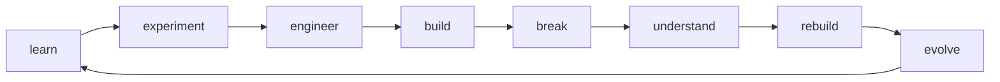

<div align="center">


# YATHARTH VIKRAM SINGH

## 🔥 **I'm not building a GitHub profile. I'm building proof of what I can become.**

[](https://www.vymra.org/)
[](https://www.linkedin.com/in/rajputyatharth0007/)
[](https://github.com/Rajputyatharth0007)

</div>

---

From **Python & Machine Learning** to **AI agents, Flutter, MongoDB, backend systems, and real-time applications** — every repository is another problem I chose to **understand by building**, not simply learn about.

What started as coding experiments is becoming something bigger:

<div align="center">

### **learn → experiment → engineer → build**

</div>

Projects like **CLF**, and everything growing around **VYMRA**, are pushing me beyond writing code — toward **designing systems, solving real problems, and turning ideas into products people can actually use.**

<div align="center">

## **Build. Break. Rebuild. Evolve.**

### That's the journey. 🚀

</div>

```text
┌────────────────────── YATHARTH / BUILD LOG ──────────────────────┐
│ Python          → taught me to think                            │
│ Machine Learning→ taught me to experiment                       │
│ AI Agents       → taught me to orchestrate                      │
│ Flutter         → taught me to ship interfaces                  │
│ MongoDB         → taught me to think in data                    │
│ Backend Systems → taught me architecture                        │
│ Real-time Apps  → taught me systems must keep moving            │
│ CLF             → taught me code has to survive reality         │
│ VYMRA           → teaching me how ideas become products         │
│                                                                  │
│ STATUS          → still becoming.                               │
└──────────────────────────────────────────────────────────────────┘
```

---

## // THINGS THAT ESCAPED MY HEAD

<table>
<tr>
<td width="50%" valign="top">

### 🚀 01 / VYMRA
Not one project.

A place for the bigger journey: building, experimenting, shipping, documenting, and seeing how far an idea can be pushed.

**theme:** technology × curiosity × creation

**[ENTER VYMRA →](https://www.vymra.org/)**

</td>
<td width="50%" valign="top">

### 🧭 02 / CLF
**what if buildings had their own GPS?**

ConneXity Location Finder explores indoor navigation using Wi-Fi signals, motion sensors, maps, localization, machine learning, backend systems, and route guidance.

Not my whole identity.  
Just one ambitious system forcing me to think beyond individual features.

</td>
</tr>

<tr>
<td width="50%" valign="top">

### 😈 03 / DEVIL AI
**what if AI agents worked like a team?**

A Google Vibe Coding Hackathon experiment around multi-agent thinking, fast prototyping, coordination, and building with AI instead of only talking about it.

**[OPEN THE EXPERIMENT →](https://github.com/Rajputyatharth0007/first-hackathon-of-our-life-)**

</td>
<td width="50%" valign="top">

### 🎮 04 / SMALL BUILDS
Not every build needs to become a startup.

Some exist because the fastest way to understand something is to make it work.

Python GUI games, Flutter interfaces, web experiments, backend experiments, and whatever I decide to build next.

**[TIC-TAC-TOE →](https://github.com/Rajputyatharth0007/tik-tak-toe)**  
**[GUESS THE NUMBER →](https://github.com/Rajputyatharth0007/Guess-the-number-game-using-GUI)**

</td>
</tr>
</table>

---

## // CURRENTLY EVOLVING

```text
[ AI / AGENTS ]       from prompts → coordinated systems
[ MACHINE LEARNING ]  from models → useful decisions
[ FLUTTER ]           from screens → usable products
[ MONGODB / DATA ]    from storing data → designing data flow
[ BACKEND SYSTEMS ]   from endpoints → architecture
[ REAL-TIME APPS ]    from request/response → live state
[ PRODUCT THINKING ]  from "it works" → "should this exist?"
[ VYMRA ]             from projects → something bigger
```

The stack can change.

The direction is the important part.

---

## // TOOLS I'VE LEFT FINGERPRINTS ON

<div align="center">


</div>

```text
not mastery meters.
not a checklist.
just evidence that I touched the thing, struggled with it, and built something.
```

---

## // MY BUILD LOOP



---

## // PROOF > PROMISES

<div align="center">


</div>

---

## // RULES OF THE LAB

```text
01. understand by building.
02. experiments are supposed to be imperfect.
03. ugly v1 > imaginary masterpiece.
04. don't just learn the tool — make the tool solve something.
05. move from features → systems → products.
06. don't collect repositories. collect evidence of growth.
```

---

<details>
<summary><b>OPEN // RANDOM SIGNALS FROM THE BUILD LOG</b></summary>
<br>

```text
• Python + Tkinter desktop projects
• machine-learning experiments
• Java fundamentals
• SQL problem solving
• Flutter application development
• MongoDB + backend exploration
• Vue / TypeScript web experiments
• AI agent hackathon work
• real-time application architecture
• indoor-navigation + spatial-system R&D
• product/UI experiments
• VYMRA journey in public
```

</details>

---

<div align="center">

## STATUS: STILL BECOMING.

### The next version should make this one look small.

`learn → experiment → engineer → build → break → rebuild → evolve`

**[VYMRA](https://www.vymra.org/) · [LINKEDIN](https://www.linkedin.com/in/rajputyatharth0007/) · [GITHUB](https://github.com/Rajputyatharth0007)**


</div>
